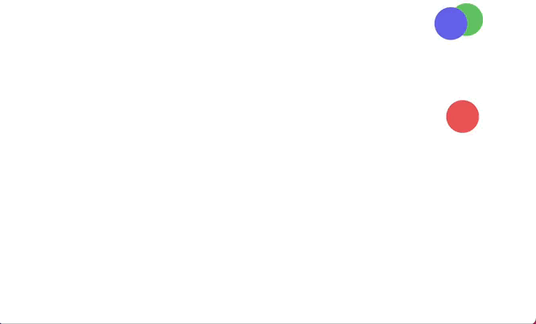

# moveBallBonus
MITxPro exercise

## Description: 
This is a fun exercise for learning first steps in javascript, implement animation, and connect the html, css and js

## Usage
Here is a preview of the outcome

 
 > Here you can see it <a href="https://agusroig.github.io/moveBallBonus/"> in action </a>
